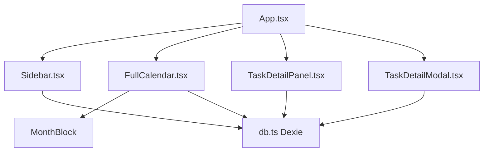
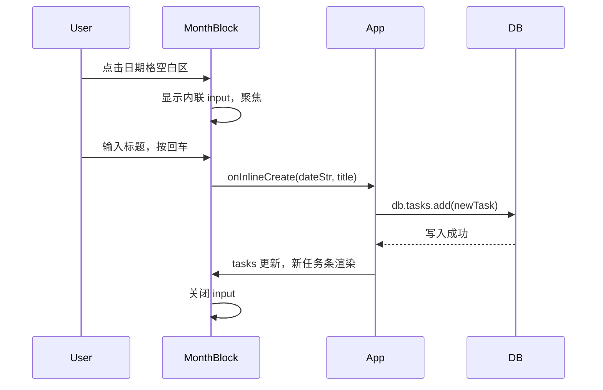
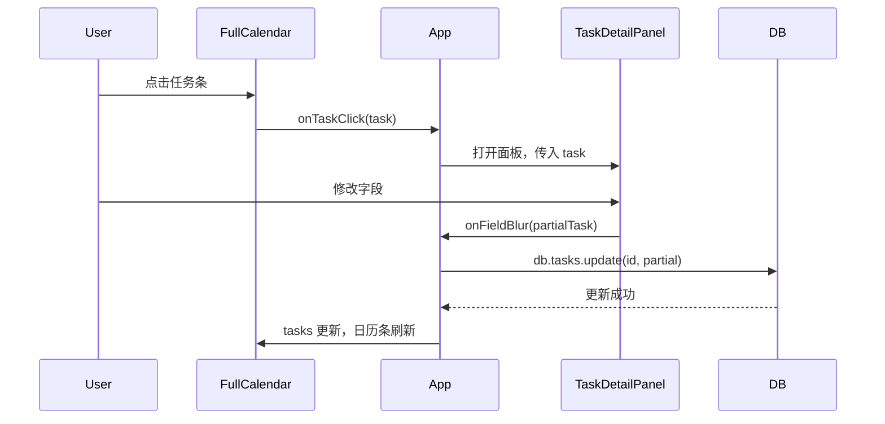

# Design Document

## Overview
**Purpose**: 将 NextDo 月视图改造为应用核心枢纽，实现即时任务创建、侧面板详情编辑、日历条信息增强和侧边栏过滤，参考 Things 3 的设计理念。

**Users**: 以月视图为主要工作界面的用户，通过日历管理日常任务。

**Impact**: 减少模态框打开次数，降低任务创建和编辑的操作步数。保持现有数据模型不变，确保所有历史备份数据可正常导入。

### Goals
- 月视图上点击日期即可创建任务（默认值填充），减少创建步骤
- 任务详情以侧面板形式呈现，日历始终可见
- 日历任务条显示象限图标、进度状态、项目颜色
- 侧边栏支持按项目和象限过滤日历内容
- 现有 TaskDetailModal 保留作为复杂编辑的降级入口
- 数据模型不变，导入完全向后兼容

### Non-Goals
- 不改造日视图、矩阵视图、列表视图
- 不新增数据库字段或 IndexedDB 版本升级
- 不修改导出格式（保持 v1.1）
- 不改动周期规则管理器
- 不涉及 AI 功能

## Boundary Commitments

### This Spec Owns
- 月视图日期格内的内联任务创建交互
- 右侧任务详情面板的 UI 和自动保存逻辑
- 日历任务条的视觉呈现增强
- 侧边栏的项目/象限筛选状态和 UI

### Out of Boundary
- TaskDetailModal 的内部逻辑（保留不动）
- 任务数据模型和持久化层
- 导出/导入格式和逻辑
- 其他三个视图（日/矩阵/列表）
- 周期规则管理

### Allowed Dependencies
- `db.ts` — Dexie 数据库操作（tasks, projects, recurringRules 表）
- `types.ts` — Task, Project, Priority, EisenhowerQuadrant, TaskProgress 类型
- `config/taskColors.ts` — 颜色和样式映射
- `utils/dateUtils.ts` — 日期格式化
- `utils/generateUUID.ts` — ID 生成
- `hooks/useToast.ts` — Toast 通知
- 现有 React 依赖（react, dexie-react-hooks, lucide-react, tailwindcss）

### Revalidation Triggers
- Task 接口字段变更
- db.ts 表结构或索引变更  
- 导出/导入格式版本号变更
- 侧边栏结构或过滤字段变更

## Architecture

### Existing Architecture Analysis
当前架构是扁平的单页应用，App.tsx 承载所有状态管理和布局。月视图通过 FullCalendar → MonthBlock 组件树渲染。任务创建通过 TaskDetailModal 弹窗完成（691 行，承载大量表单字段）。EventPopover 提供日历上任务点击后的快捷信息浮窗。

改造保持此扁平结构，不引入新层级，仅做组件职责重新分配：
- 从 App.tsx JSX 中提取侧边栏为独立组件
- 新增侧面板组件，替代 EventPopover 作为主要详情入口
- FullCalendar 的 MonthBlock 增加内联输入能力

### Architecture Pattern & Boundary Map



**Architecture Integration**:
- 不改变现有数据流方向（UI → db.ts → IndexedDB）
- 侧边栏从 App.tsx 提取，通过 props 接收过滤状态和回调
- 侧面板与 TaskDetailModal 共享 saveTask 函数签名
- MonthBlock 通过新的 `onDateInlineCreate` 回调通知父组件

### Technology Stack

| Layer | Choice / Version | Role in Feature | Notes |
|-------|------------------|-----------------|-------|
| Frontend | React 19 + TypeScript | UI 组件 | 不变 |
| Data | Dexie.js 4.0.1 | IndexedDB 操作 | 不变 |
| Styling | Tailwind CSS 4.x (CDN) | 样式 | 不变 |
| Icons | lucide-react 0.562 | 图标 | 不变 |

## File Structure Plan

### New Files
```
components/
├── TaskDetailPanel.tsx    # 右侧详情面板，替代 EventPopover 作为主要编辑入口
├── Sidebar.tsx            # 提取的侧边栏组件，含视图切换、项目/象限过滤
hooks/
└── useCalendarFilters.ts  # 过滤状态管理 hook
```

### Modified Files
```
App.tsx                    # 引入新组件，新增侧面板/过滤状态，移除内联侧边栏 JSX
components/FullCalendar.tsx # MonthBlock 增加内联输入框
```

### Unchanged (reference only)
```
types.ts                   # Task 数据模型不变
db.ts                      # 数据库操作不变
config/taskColors.ts       # 颜色配置不变
services/autoBackup.ts     # 备份逻辑不变
components/TaskDetailModal.tsx  # 保留作为复杂编辑降级入口
components/EventPopover.tsx     # 保留，月视图外可能仍用
```

## System Flows

### 内联创建流程



### 侧面板编辑流程



## Requirements Traceability

| Requirement | Summary | Components | Interfaces | Flows |
|-------------|---------|------------|------------|-------|
| 1.1 | 点击日期显示内联输入 | MonthBlock | onInlineCreate | 内联创建流程 |
| 1.2 | 回车创建任务 | App, MonthBlock | saveTask | 内联创建流程 |
| 1.3 | Escape 取消输入 | MonthBlock | — | — |
| 1.4 | 新任务立即显示 | FullCalendar, DB | useLiveQuery | — |
| 1.5 | 空输入不创建 | MonthBlock | — | — |
| 2.1 | 点击任务打开侧面板 | TaskDetailPanel, App | onTaskClick | 侧面板编辑流程 |
| 2.2 | 显示所有字段 | TaskDetailPanel | Task 接口 | — |
| 2.3 | 离开字段自动保存 | TaskDetailPanel, App | onFieldUpdate | 侧面板编辑流程 |
| 2.4 | 点击外部关闭 | TaskDetailPanel | onClose | — |
| 2.5 | 点击另一任务切换 | TaskDetailPanel, App | selectedTaskId | — |
| 2.6 | 空标题阻止保存 | TaskDetailPanel | — | — |
| 2.7 | 面板内删除任务 | TaskDetailPanel | onDelete | — |
| 3.1 | 显示象限图标 | MonthBlock | QuadrantIcon | — |
| 3.2 | 显示进度状态 | MonthBlock | getProgressDisplay | — |
| 3.3 | 项目颜色渲染 | MonthBlock | project.color | — |
| 3.4 | 已完成降透明度 | MonthBlock | CSS opacity | — |
| 3.5 | 悬停高亮 | MonthBlock | CSS hover | — |
| 4.1 | 项目过滤日历 | Sidebar, App | filterProjectId | — |
| 4.2 | 全部项目取消过滤 | Sidebar | — | — |
| 4.3 | 象限过滤日历 | Sidebar, App | filterQuadrant | — |
| 4.4 | 全部象限取消过滤 | Sidebar | — | — |
| 4.5 | 过滤条件叠加 | App, useCalendarFilters | AND 逻辑 | — |
| 4.6 | 显示任务计数 | Sidebar | tasks.length | — |
| 5.1 | v1.0 补充 progress | SettingsModal | 保持不变 | — |
| 5.2 | v1.1 完整恢复 | SettingsModal | 保持不变 | — |
| 5.3 | 高版本忽略未知字段 | SettingsModal | 保持不变 | — |
| 5.4 | 导入后刷新 | SettingsModal | 保持不变 | — |
| 5.5 | 不新增字段依赖 | types.ts | 保持不变 | — |

## Components and Interfaces

| Component | Domain/Layer | Intent | Req Coverage | Key Dependencies | Contracts |
|-----------|--------------|--------|--------------|------------------|-----------|
| Sidebar | UI | 视图切换+项目/象限过滤 | 4.1–4.6 | db (P0) | State |
| MonthBlock (modified) | UI | 月历渲染+内联创建 | 1.1–1.5, 3.1–3.5 | — | State |
| TaskDetailPanel | UI | 侧面板任务详情编辑 | 2.1–2.7 | db (P0) | Service, State |
| useCalendarFilters | Logic | 过滤状态管理 | 4.1–4.5 | — | State |

### UI Layer

#### Sidebar
| Field | Detail |
|-------|--------|
| Intent | 显示视图切换、项目列表、象限过滤，支持点击过滤日历 |
| Requirements | 4.1, 4.2, 4.3, 4.4, 4.6 |

**Responsibilities & Constraints**
- 管理视图切换（月/日/矩阵/列表）
- 显示项目列表并支持选中过滤
- 显示象限选项并支持选中过滤
- 显示各筛选项的任务数量
- 折叠/展开侧边栏

**Dependencies**
- Outbound: db (projects, tasks) — 获取项目和任务数据 (P1)
- Outbound: lucide-react — 图标 (P2)

**Contracts**: State [x]

##### State Management
- Props: `viewMode`, `onViewModeChange`, `filterProjectId`, `onProjectFilter`, `filterQuadrant`, `onQuadrantFilter`, `projects`, `taskCounts`, `isCollapsed`, `onToggleCollapse`

#### MonthBlock (modified)
| Field | Detail |
|-------|--------|
| Intent | 渲染单月日历，支持内联任务创建和增强的任务条展示 |
| Requirements | 1.1, 1.2, 1.3, 1.5, 3.1, 3.2, 3.3, 3.4, 3.5 |

**Responsibilities & Constraints**
- 在日期格空白区域响应点击，显示内联输入框
- 处理内联输入的提交（回车创建）和取消（Escape）
- 任务条显示象限图标、进度文字、项目颜色
- 已完成任务以低透明度渲染
- 悬停时高亮任务条

**Dependencies**
- Outbound: taskColors — 颜色和象限样式 (P2)

**Contracts**: State [x]

##### State Management
- Internal: `inlineInputDate` (当前激活输入的日期), `inlineInputValue` (输入内容)
- Props: 新增 `onInlineCreate(dateStr: string, title: string)`

#### TaskDetailPanel
| Field | Detail |
|-------|--------|
| Intent | 右侧滑出面板，替代 EventPopover 作为主要任务详情入口 |
| Requirements | 2.1, 2.2, 2.3, 2.4, 2.5, 2.6, 2.7 |

**Responsibilities & Constraints**
- 从右侧滑入，不遮挡日历
- 显示所有 Task 字段并可编辑
- 字段失焦时自动调用 onUpdate 保存
- 空标题时阻止保存并提示
- 支持在面板内删除任务（带确认）
- 提供「更多详情」按钮打开 TaskDetailModal（用于编辑依赖、周期规则等复杂字段）

**Dependencies**
- Outbound: db — 任务更新和删除 (P0)
- Outbound: TaskDetailModal — 复杂编辑降级入口 (P1)

**Contracts**: Service [x], State [x]

##### Service Interface
```typescript
interface TaskDetailPanelProps {
  task: Task | null;
  isOpen: boolean;
  onClose: () => void;
  onUpdate: (task: Partial<Task>) => Promise<void>;
  onDelete: (id: string) => Promise<void>;
  onOpenFullEditor: (task: Task) => void;
  projects: Project[];
  allTasks: Task[];
  addToast: (message: string, type: ToastType) => string;
}
```

##### State Management
- Internal: 编辑中的表单字段状态
- 修改标记：字段失焦时对比初始值，有变更则调用 onUpdate

#### useCalendarFilters
| Field | Detail |
|-------|--------|
| Intent | 管理日历过滤状态（项目+象限），返回过滤后的任务列表 |
| Requirements | 4.1, 4.2, 4.3, 4.4, 4.5 |

##### Service Interface
```typescript
function useCalendarFilters(
  tasks: Task[],
  filterProjectId: string | null,
  filterQuadrant: EisenhowerQuadrant | null
): { filteredTasks: Task[]; counts: { projects: Map<string, number>; quadrants: Map<string, number> } }
```

## Data Models
无数据模型变更。保持现有 Task、Project、RecurringRule 接口不变。导入导出版本号保持 v1.1。

## Error Handling

### Error Categories and Responses
- **空标题提交**: 内联创建和侧面板均在提交前校验，空标题不执行创建/更新
- **数据库写入失败**: 依赖现有 Dexie 错误机制，通过 Toast 通知用户
- **过滤无结果**: 日历显示空状态提示文案

## Testing Strategy

### Unit Tests (manual verification)
- 内联创建：点击日期格→输入标题→回车→任务出现在日历上
- 内联取消：点击日期格→输入标题→Escape→任务不创建
- 空标题：点击日期格→直接回车→不创建任务
- 侧面板保存：点击任务→修改优先级→点击其他区域→重新打开面板确认已保存
- 过滤叠加：选择项目+象限→日历仅显示同时匹配的任务
- 过滤计数：侧边栏项目名旁的数字与日历显示任务数一致
- 导入 v1.0 数据：导入无 progress 字段的旧备份→确认 progress 字段正确补充
- 导入 v1.1 数据：导入当前版本备份→确认全部数据恢复

### Integration Tests (manual verification)
- 内联创建→侧面板编辑→日历刷新：完整的创建-编辑-查看闭环
- 过滤→创建→过滤保持：在过滤状态下创建任务，确认过滤未失效且新任务符合过滤条件
- 侧面板→删除→日历更新：侧面板内删除任务，确认日历即时刷新

### E2E Tests (manual verification)
- 用户核心路径：打开应用→月视图→点击日期创建任务→点击任务打开侧面板→修改进度→关闭面板
- 导入兼容路径：设置→导出备份→清除数据→导入备份→确认所有数据恢复
